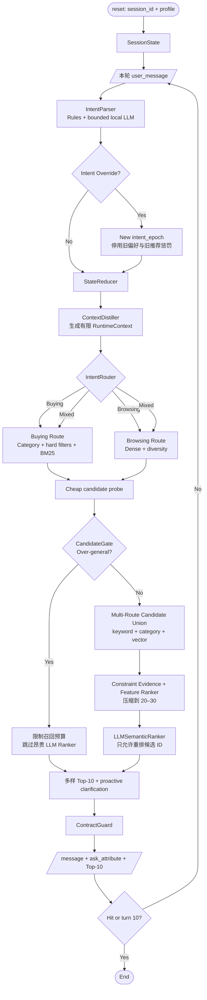

# Shopping Copilot Technical Design

## 1. Design Summary

采用“显式状态机 + 动态双路检索 + 受控 LLM 语义精排”的单进程架构。`Agent.respond()` 每轮根据 distilled runtime context 重新路由，但不允许自由工具循环：



核心选择是把“模型可能出错的语义理解”与“绝不能出错的商品边界和状态归并”分开。流程完全可由普通函数串联，无需 LangGraph。

## 2. Design Principles

1. **Exact-ID first**：最终目标是 target `parent_asin` 进入前 10，不把自然语言流畅度等同于推荐质量。
2. **Ask and recommend together**：每轮都利用 Top-10 配额，同时用一个结构化问题获取下一轮信息。
3. **State is data, not chat history**：聊天文本只作为证据；有效状态由类型化结构表示。
4. **Fail open on missing metadata**：未知不等于矛盾，避免因 catalog 信息缺失误杀目标。
5. **Intent epochs**：推荐历史和排除逻辑绑定当前意图，override 后重新开始。
6. **Runtime routing, bounded execution**：每轮允许 Buying/Browsing 路线切换，但召回预算、候选上限和模型调用次数必须有硬边界。
7. **Deterministic shell around probabilistic core**：模型只提出结构化更新，Python 校验并最终裁决。
8. **LLM ranks, never retrieves IDs**：LLM Semantic Ranker 只能重排已验证候选，不能凭空生成 catalog ID。

## 3. Component Architecture

### 3.1 Public Agent Facade

`starter/agent.py::Agent` 只负责：

- 初始化 catalog、索引、可选模型与配置；
- 管理 `SessionStore`；
- 在 `reset` 创建全新会话；
- 在 `respond` 调用固定 pipeline；
- 捕获内部错误并构造合同合法的 fallback。

它不直接包含解析规则、SQL、融合公式或提问启发式。

### 3.2 CatalogRepository

启动时读取 `data/catalog.jsonl`，生成统一 `ProductRecord`：

```python
ProductRecord(
    parent_asin: str,
    title: str,
    categories: tuple[str, ...],
    features: tuple[str, ...],
    description: tuple[str, ...],
    details: dict[str, str],
    store: str | None,
    price: float | None,
    rating: float | None,
    rating_count: int | None,
    canonical_text: str,
)
```

Repository 是合法 ID 与商品字段的事实来源，并提供字段规范化、价格解析、属性 evidence 和结果 materialization。FTS5 保留为进程内索引；若 dense 被启用，则加载与 catalog checksum、document schema version、embedding model version 绑定的预计算向量。

### 3.3 SessionStore and SessionState

```python
SessionState(
    session_id: str,
    profile: UserProfile,
    session_profile: DistilledProfile,
    category_anchor: str | None,
    constraints: list[Constraint],
    no_preference: set[Attribute],
    asked_attributes: list[Attribute],
    messages: list[TurnMessage],
    intent_epoch: int,
    recommendations_by_epoch: dict[int, list[str]],
    last_candidate_ids: list[str],
    last_candidate_stats: CandidateStats | None,
    active_route: Literal["buying", "browsing", "mixed"],
    last_state_fingerprint: str | None,
)
```

`reset` 必须覆盖同名会话的旧状态。Store 第一版是 `dict[str, SessionState]`；不增加数据库。状态对象不保存 ground truth、intent card 或 evaluator 内部字段。

### 3.4 IntentParser

解析采用两个通道：

1. **DeterministicParser**：识别 override 标记、否定/撤回、无偏好、价格、常见材质/颜色/尺码、类目和显式品牌等高精度模式。
2. **ModelIntentParser（目标 MVP 必备）**：只对规则不能稳定归一化的片段生成严格 schema，不得直接返回商品 ID、SQL 或排序结果。具体本地 backend 需要通过资源 gate，但不因“不使用框架”而删除模型能力。

统一输出：

```python
IntentUpdate(
    global_override: bool,
    mutations: list[ConstraintMutation],
    category_anchor: str | None,
    no_preference: set[Attribute],
    query_terms: list[str],
    confidence: float,
)

ConstraintMutation(
    action: Literal["upsert", "replace", "remove"],
    attribute: Attribute,
    value: str,
    polarity: Literal["prefer", "avoid", "require"],
    hardness: Literal["hard", "soft"],
    source: Literal["user", "profile", "model", "rule"],
    confidence: float,
)
```

规则结果优先保护明确数字、否定和 override；模型只能补充，不可覆盖高置信规则事实。模型无效、超时或低置信时使用规则结果继续运行。该 fallback 用于保证单次调用不变成 miss；最终提交配置仍需提供声明过的本地模型路径，而不是把 pure-rule 模式包装成完整 MVP。

### 3.5 StateReducer

Reducer 是唯一允许修改约束状态的组件：

- `upsert`：加入新属性值，合并同义值；
- `replace`：停用同属性旧值，保留审计记录；
- `remove`：停用明确撤回的值；
- `no_preference`：移除该属性的非硬约束，标记不再追问；
- `global_override`：`intent_epoch += 1`，停用旧的对话偏好，保留独立的类目锚点和 profile 弱先验，再应用本轮新约束；
- 新 epoch 不继承旧 epoch 的已推荐惩罚，因为 override 前即使出现 target，评测器也不会结束会话。

每次归并后生成稳定 `state_fingerprint`，用于检索缓存与可重复诊断。

### 3.6 ContextDistiller

ContextDistiller 不把完整聊天记录直接交给每个模块，而是每轮生成一个有界、可缓存的运行上下文：

```python
RuntimeContext(
    route_hint: Literal["buying", "browsing", "mixed"],
    category_anchor: str | None,
    hard_constraints: tuple[Constraint, ...],
    soft_preferences: tuple[Constraint, ...],
    avoided_values: tuple[Constraint, ...],
    profile_priors: tuple[str, ...],
    unanswered_attributes: tuple[Attribute, ...],
    intent_epoch: int,
    turn: int,
    remaining_turns: int,
    candidate_stats: CandidateStats | None,
)
```

provided profile 是基础长期先验，session 内新信息形成 `session_profile`。由于协议没有稳定 user ID，不把一个 session 的学习写入另一个 session，也不宣称实现真实跨用户长期记忆。

### 3.7 IntentRouter and AdaptiveOrchestrator

`IntentRouter` 每轮根据 specificity、活动硬约束、vagueness markers、candidate statistics 和用户是否仍在探索，输出路线与权重：

```python
RouteDecision(
    mode: Literal["buying", "browsing", "mixed"],
    buying_weight: float,
    browsing_weight: float,
    retrieval_budget: int,
    reason_code: str,
)
```

- **Buying**：预算、颜色、材质、尺码、品牌或明确用途已经形成可执行约束；优先 category/keyword、可靠 hard filter 和精确排序。
- **Browsing**：表达开放、跨类目或场景导向，缺少可执行硬约束；优先 dense recall 与多样性。
- **Mixed**：既有硬约束又保留探索空间；两路并行后融合。

`AdaptiveOrchestrator` 只是读取 `RuntimeContext` 和 `RouteDecision` 后选择有界策略：是否运行 Dense、每路 Top-N、是否触发 CandidateGate、是否调用 LLM Ranker。它不修改代码、不自写 prompt，也不形成无上限 agent loop。

### 3.8 QueryPlanner

Planner 输出若干用途明确的 `RetrievalQuery`，而不是一个不断变长的字符串：

- latest-turn query：强调本轮新信息；
- buying query：类目 + 活动硬约束，偏向高 precision；
- browsing query：类目 + 场景/用途 + 软偏好，偏向语义 recall 与多样性；
- profile expansion query：低权重 profile tags；
- cheap probe query：只估计候选规模/分布，供 CandidateGate 使用；
- recovery query：当严格查询候选不足时逐级放宽。

字段策略：title/category 权重最高，features/details 次之，description/store 较低。硬约束不全部用 `AND` 锁死；候选生成偏 recall，精确约束交给 evidence/ranking。

### 3.9 Multi-Route Candidate Retrieval

#### Buying Route — precision first

- category narrowing、可靠 hard filter 与 SQLite FTS5/BM25；
- 每个 retrieval query 分别取 Top-N；
- 保留来源、原始 rank、BM25 分和命中字段；
- 对特殊字符和空 query 做安全转义；
- 候选不足时使用类目/流行度 recovery。

#### Browsing Route — semantic diversity first

- catalog frozen，因此商品 embedding 离线预计算；在线只编码 state query；
- 本地 brute-force cosine 对 50k 规模可作为首选验证基线，只有实测需要才引入 ANN；
- dense top-N 加入适度 category diversity，避免语义近邻被单一款式垄断；
- 与 Buying route 的 keyword/category 候选求 union；
- 资产必须包含 manifest/checksum，模型不可在线临时下载。

Dense 是目标 Browsing 路线的组成部分，但部署仍受资源 gate 约束：在分层 validation/locked holdout 上必须对 candidate recall@50/100 有稳定互补增益，同时 CPU、内存、启动和包大小在提交预算内。资源条件不允许时，fallback 使用 broad lexical + category diversity，并在报告中明确不等价于完整 Browsing route。

### 3.10 CandidateGate — over-generality cutoff

在昂贵语义精排前先执行 cheap probe，计算：

```python
CandidateStats(
    estimated_count: int,
    route_overlap: float,
    category_entropy: float,
    attribute_entropy: dict[Attribute, float],
    active_hard_constraint_count: int,
)
```

CandidateGate 输出 `focused` 或 `over_general`。阈值不只看数量：大量高度同质候选可能已经足够明确，少量但跨多个用途的候选仍可能需要澄清。

- `focused`：运行完整 multi-route retrieval、Feature Ranker 和 LLM Semantic Ranker。
- `over_general`：限制本轮候选预算，跳过昂贵 LLM Semantic Ranker，使用廉价多样化 Top-10，并立即选择分裂候选集能力最高的 `ask_attribute`。

即使 cutoff，本轮仍返回 Top-10，避免浪费可能的早期命中。

### 3.11 Candidate Fusion and Constraint Evidence

不同召回分数不可直接相加。首选 Reciprocal Rank Fusion：

```text
rrf_score(d) = sum_source 1 / (k + rank_source(d))
```

候选随后获得结构化 evidence：

```python
ConstraintEvidence(
    attribute: Attribute,
    verdict: Literal["match", "contradict", "unknown"],
    confidence: float,
)
```

可靠 budget 超限、明确相反颜色/材质等可判为 contradict；字段缺失是 unknown。默认只有高置信 hard contradict 才过滤，其余以奖励/惩罚进入排序。

### 3.12 Deterministic Feature Ranker

基础排序分由可解释特征组成：

```text
score = retrieval_fusion
      + hard_match_bonus
      + soft_match_bonus
      + profile_prior
      + quality_prior
      - hard_contradiction_penalty
      - same_epoch_seen_penalty
```

- profile 只作为弱先验，不得覆盖当前用户硬约束；
- rating_count 可用平滑/log 变换，避免纯热门商品垄断；
- 同一 intent epoch 中，之前已经推荐且未命中的商品强降权或排除，提高 10 轮累计覆盖；
- 状态发生普通增量更新后允许少量重现高置信商品，但目标若已出现会话本应结束，因此默认仍显著惩罚；
- override 创建新 epoch 后 seen penalty 清零。

Feature Ranker 将 union 压缩到 20–30 个 catalog-valid 候选，为 LLM Semantic Ranker 提供小而高召回的输入。可选 CrossEncoder 只作为候选压缩方式的实验对照；它无法取代官方要求的 LLM semantic ranking 叙事，也无法找回未召回目标。

### 3.13 LLMSemanticRanker

LLMSemanticRanker 是 focused path 的目标 MVP 主能力，每轮最多执行一次 listwise ranking：

```python
SemanticRankingRequest(
    distilled_intent: str,
    hard_constraints: tuple[Constraint, ...],
    candidates: tuple[CompressedProduct, ...],  # 20–30
)

SemanticRankingResult(
    ordered_parent_asins: tuple[str, ...],
    scores: dict[str, float],
    usage: TokenUsage | None,
)
```

关键边界：

- candidate text 只保留 title、category、price、store 和最相关 feature/detail，避免 prompt 无界增长；
- 输出 ID 必须是输入候选的子集，重复、未知和遗漏由 ContractGuard/Feature Ranker 修复；
- temperature 固定，prompt 与 schema 版本化；
- 模型超时或非法输出时回退 Feature Ranker；
- 模型后端按固定顺序尝试：`deepseek-v4-flash` API、显式配置的 3B–8B 本地 OpenAI-compatible endpoint、确定性 Feature Ranker。后端失败只触发下一层，不改变候选白名单。
- 默认无环境变量时完全离线，不进行隐式网络访问。仅真实模型响应可贡献 usage。

LLM 负责候选之间的细粒度语义比较，Coverage 仍由 multi-route retrieval 保证，硬约束仍由确定性 evidence 保护。

### 3.14 ClarificationPolicy

ClarificationPolicy 可由 CandidateGate 的 over-general path 立即调用，也可在 focused path 完成排序后调用。候选属性分数：

```text
question_value(attribute) =
    expected_disclosure(attribute)
  * candidate_entropy(attribute)
  * remaining-turn-value
  - repeated_or_exhausted_penalty
  - extraction_uncertainty
```

策略排除：已明确无偏好、已问且无新增信息、候选无法解析、当前已是最后一轮的属性。

提供两个可配置 policy 以便实验：

- `protocol_aware`：优先使用能获得未披露约束的属性；`other` 是明确兜底，并允许在仍有信息时重复一次。
- `catalog_entropy`：在 material/color/size/style/budget/feature/use_case 等属性中选候选集分裂度最高者，交互更自然。

两者必须分开报告，不把 `other` 在当前模拟器中的 wildcard 行为包装成普遍的商业推荐能力。

### 3.15 ResponseBuilder and ContractGuard

ResponseBuilder 使用简短模板或可选模型生成自然语言，但 `ask_attribute` 与商品列表来自确定性组件。ContractGuard 在返回前执行：

- `message` 必为字符串；
- `ask_attribute` 在允许枚举内；
- recommendations 只来自 Repository，按顺序去重并截断到 `top_k`；
- score 若输出必须为有限数字；
- usage 只有真实可得时才累计，不能伪造；
- 候选为空时使用 catalog recovery，而不是返回无效 schema。

## 4. Runtime Flows

### 4.1 Reset

```text
validate profile
  -> normalize low-cardinality preference tags as soft priors
  -> replace sessions[session_id]
  -> no retrieval/model call
```

### 4.2 Normal Turn

```text
load state
  -> parse message
  -> validate and reduce update
  -> distill RuntimeContext
  -> route Buying / Browsing / Mixed
  -> run cheap candidate probe
  -> CandidateGate
     -> over-general: capped diverse retrieval + proactive clarification
     -> focused: multi-route retrieval + feature rank + one LLM semantic rank
  -> record recommendations under current epoch
  -> contract guard
```

### 4.3 Intent Override

```text
detect "ignore/actually/instead" + new requirement
  -> new intent epoch
  -> deactivate old conversational preferences
  -> preserve category anchor and profile soft priors
  -> apply new hard requirement
  -> invalidate caches
  -> retrieve from scratch
  -> do not penalize IDs shown in prior epoch
```

### 4.4 Boundary / No Preference

```text
detect no-preference(attribute)
  -> mark attribute exhausted
  -> do not invent a value
  -> retain other constraints
  -> rank with remaining evidence
  -> ask another useful attribute or None
```

### 4.5 Failure Flow

Model、dense 或 semantic ranker 的错误均在各自 adapter 内隔离：

```text
intent-model fail -> deterministic parse
dense fail -> broad lexical/category browsing fallback
LLM semantic rank fail -> feature rank order
message generation fail -> template message
unexpected pipeline fail -> valid popularity/category fallback response
```

任何降级都写入 diagnostics，但不污染公开 schema。

## 5. Proposed Module Layout

```text
starter/
  agent.py                 # public facade only
  shopping_agent/
    __init__.py
    config.py              # dataclass/env configuration
    types.py               # state, updates, candidates, evidence
    catalog.py             # JSONL loading and normalized records
    session.py             # SessionStore and StateReducer
    intent.py              # deterministic + model-assisted parsing
    model.py               # DeepSeek API/local OpenAI-compatible/fallback chain
    context.py             # ContextDistiller and RuntimeContext
    routing.py             # IntentRouter and bounded orchestration
    query.py               # query planning and state fingerprint
    lexical.py             # SQLite FTS5 retrieval
    dense.py               # Browsing-route local vector retrieval
    gating.py              # cheap probe and CandidateGate
    fusion.py              # RRF and candidate union
    constraints.py         # match/contradict/unknown evidence
    ranking.py             # deterministic feature ranker
    semantic_ranking.py    # bounded listwise LLM semantic ranking
    policy.py              # clarification policy
    response.py            # message builder and ContractGuard
    diagnostics.py         # timings, counters, trace hooks
tests/
  test_agent_contract.py
  test_session_state.py
  test_intent_parser.py
  test_retrieval.py
  test_ranking.py
  test_clarification_policy.py
  test_agent_scenarios.py
scripts/
  build_assets.py          # only if dense assets are accepted
  run_experiments.py       # config + split + evaluator wrapper
```

第三方模型依赖通过 extras 或单独 requirements 明确声明；lexical-only 路径保持尽量轻量。

## 6. Configuration

`AgentConfig` 集中定义并支持环境变量覆盖：

- route thresholds、per-route retrieval limits、RRF k、字段权重；
- CandidateGate candidate-count/entropy thresholds；
- hard/soft/profile/seen/quality 权重；
- question policy；
- dense、LLM semantic ranker 和 fallback feature flags；
- model endpoint/key environment variable names；
- timeout、batch size、fallback 行为；
- diagnostics 开关。

模型相关环境变量首版固定为：

- `SHOPPING_AGENT_DEEPSEEK_API_KEY`：存在时启用 DeepSeek API；
- `SHOPPING_AGENT_DEEPSEEK_BASE_URL`：默认 `https://api.deepseek.com`；
- `SHOPPING_AGENT_DEEPSEEK_MODEL`：默认 `deepseek-v4-flash`；
- `SHOPPING_AGENT_LOCAL_BASE_URL` 与 `SHOPPING_AGENT_LOCAL_MODEL`：两者同时存在时启用本地后端；
- `SHOPPING_AGENT_MODEL_TIMEOUT_SECONDS`：每个模型请求的硬超时。

DeepSeek-V4-Flash 的开放权重约 166.9 GB，官方示例使用服务器级多 GPU，因此不作为普通开发机或官方未知环境的本地 fallback。这里的 3B–8B fallback 通过相同受控协议接入，具体 checkpoint 后续基准决定。

运行时不能从 public labels 自动调参。实验配置与提交默认配置分离，最终配置冻结并记录 hash。

## 7. Evaluation Strategy

### 7.1 Dataset discipline

- 以 scenario + difficulty 分层固定 seed；建议 60% dev / 20% validation / 20% locked holdout。
- 也可用 scenario-stratified cross-validation 检查稳定性，但 locked holdout 仍保持少量访问。
- ground truth 仅在离线评价脚本使用，不进入 Agent 对象或资产。

### 7.2 Metrics

官方指标：HitRate@10、MRR、MTTC、Efficiency、TechnicalScore，均按场景报告。

诊断指标：

- candidate recall@10/50/100；
- lexical/dense overlap 与独有命中；
- constraint contradiction/unknown 率；
- 每个 attribute 的提问率与有效披露率；
- same-epoch unique recommendation coverage；
- override 后恢复命中率；
- Buying/Browsing/Mixed route 分布与 route transition；
- over-generality cutoff 率、cutoff 后有效披露率；
- model/dense/semantic-ranker fallback 次数；
- init time、RSS、respond p50/p95/max、token/cost。

### 7.3 Ablation order

1. 官方 weak baseline 复现；
2. session state + 每轮提问且推荐；
3. ContextDistiller + IntentRouter：Buying/Browsing/Mixed；
4. Buying lexical/category/hard-filter route；
5. Browsing dense/diversity route + multi-route RRF；
6. CandidateGate + proactive clarification；
7. Feature Ranker + seen-item coverage / intent epochs；
8. LLM listwise semantic ranker vs feature-only/cross-encoder 对照；
9. model-assisted parser 的歧义集增益与组合配置冻结。

## 8. Compatibility and Rollback

- 不修改 evaluator 或 API contract。
- 每个增强层均有 feature flag；回滚顺序为 message generation → model parsing → LLM semantic ranking → dense browsing route → adaptive question policy → buying lexical/state core。
- catalog schema 改动用 versioned canonical document 与 asset manifest 处理；manifest 不匹配时拒绝加载 dense 资产并回退 lexical。
- 若第三方依赖无法安装，提交说明必须明确最小可运行配置及其能力，而不是静默下载模型。

## 9. Risks and Mitigations

| Risk | Mitigation |
| --- | --- |
| 200 public samples 过拟合 | 分层 locked holdout、逐模块 ablation、少调权重、不做 target lookup |
| `other` wildcard 模拟器捷径 | 与 catalog-entropy policy 分开报告，最终选择需看 holdout 与产品合理性 |
| metadata 缺失导致硬过滤误杀 | match/contradict/unknown 三值证据，unknown fail open |
| override 后旧状态污染 | 独立 category anchor、active/inactive constraint、intent epoch 与 cache invalidation |
| 重复推荐浪费 10 轮覆盖 | same-epoch seen penalty；override 后重置 |
| Router 把 Buying/Browsing 分错 | 每轮重路由、Mixed route、reason code 与场景分层评估 |
| CandidateGate 过早 cutoff | cheap probe 校准、仍返回多样 Top-10、按 disclosure/MTTC 做 ablation |
| LLM 格式/网络失败 | 严格 schema、timeout、deterministic fallback、在线能力可关闭 |
| dense/LLM ranker 太重 | capped candidates、单轮单次模型调用、CPU benchmark、asset manifest、feature-rank fallback |
| 模块异常被 evaluator 静默算 miss | Agent 内诊断、合同测试、全场景集成测试、合法 fallback response |

## 10. Architectural Decision

当前选择纯 Python 显式 pipeline，不使用 LangGraph。官方四支柱通过下列有界组件实现：Dual-Track 由 `IntentRouter`，Over-Generality 由 `CandidateGate`，Dynamic Context Programming 由 `ContextDistiller + AdaptiveOrchestrator`，LLM Semantic Ranking 由一次性 listwise `LLMSemanticRanker` 实现。只有未来出现多工具循环、持久化中断恢复、人工审批或跨服务长任务时才重新评估图编排。
