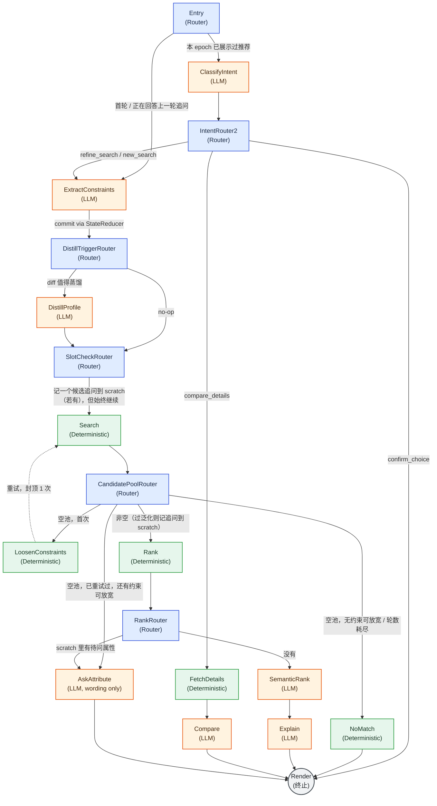

# Shopping Agent 架构（v2：Router / Value-Node 静态状态机）

> 本文档描述的是当前代码库里实际运行的架构（`starter/shopping_agent/graph.py`），
> 取代了此前 `c891de8`/`b24a40d` 引入的"模型自选工具"式 tool-loop 架构。旧架构已被
> 判定为设计错误并整体移除（`starter/shopping_agent/actions.py`/`planner.py`/
> `orchestrator.py`/`tools.py` 已删除，不再存在于代码库中），原因见下文第 0 节。

## 0. 为什么重写：旧架构错在哪

旧架构里，每一步"接下来调用哪个工具"是由模型（DeepSeek）自己决定的：模型看到一份工具列表，
自己选一个或多个工具调用，Runtime 只负责校验参数合法性、执行、把结果喂回模型，如此循环直到模型
自己觉得"够了"。这意味着控制流的决定权始终握在模型手里——模型可能在某一步"忘记"该继续搜索、
提前收敛、或者在工具之间来回摇摆，而这些失败模式无法在设计阶段穷举，只能靠运行时的步数/时间预算
兜底。

新架构把"决定下一步去哪"和"这一步的具体内容是什么"彻底分开，成为两种互不重叠的角色：

- **Router（路由）**：纯代码，输入当前 state，输出"下一个节点名 + 参数"。不调用模型，不产生新事实。
- **Value Node（取值节点）**：产出恰好一个事实，通过唯一的状态提交入口写回 state。可以是确定性算法
  （检索、排序、查目录），也可以是一次结构化输入输出的 LLM 调用，但**永远不能决定下一步去哪**。

这样整条对话流程变成一张在设计阶段就能画出来、节点数量和分支已知的**静态有限状态机**，而不是运行时
才知道会发生什么的自由循环。模型不再拥有"要不要继续"的权力——它只回答 Router 抛给它的单一结构化
问题。

完整的设计推导过程见 `.trellis/tasks/08-28-agent-v2-router-value-node/design.md`；本文档只讲当前
代码库里实际是什么样子。

## 1. 主循环

`starter/shopping_agent/graph.py::run_graph()` 精确实现这个循环：

```python
node = "Entry"
while node != "Done":
    node, args = ROUTERS[node](state)   # 纯代码：决定下一步去哪
    state = NODES[node](state, args)     # 执行该节点：产出新事实，写回状态
return render(state)
```

`ROUTERS`/`NODES` 是两张按节点名索引的静态字典，一一对应。循环本身由 harness（`run_graph`）独占，
`MAX_INTERNAL_STEPS`（42，节点数的 3 倍冗余）只是一个防御性熔断——用来在未来某次编辑不小心引入一条
没有计数器保护的死循环时立刻报错，不是用来"兜底模型可能循环 K 次"的预算机制。真正保证终止的是：整张
图是一个 DAG，唯一允许重复经过的边是下面这条有计数器保护的回边。

`starter/agent.py::Agent.respond()` 每次官方 turn 调用一次 `run_graph()`；`Agent.reset/respond` 的
公开签名和响应 schema 完全不变，`evaluator/local_evaluator.py` 无需感知这次重写。

完整可导出的架构图（含图例、场景对照、导出方式）见 `docs/architecture_diagram.md`；下面是同一张图，
颜色含义：🔵 Router（纯代码）、🟢 确定性 Value Node、🟠 LLM Value Node、⚪ 终止节点，虚线是全图唯一
允许重复经过的一条边。



## 2. 唯一允许的一条环：空搜索自动放宽重试

设计原则并不禁止环，禁止的是"模型决定环要不要继续转"。只要环的重复次数由 state 里一个 Router 会检查
的计数器限定，环和无环一样安全。这张图里唯一的环是：

```
CandidatePoolRouter --(候选池为空, search_retry_count==0)--> LoosenConstraints --> Search --> CandidatePoolRouter
```

`Search` 返回空候选池时，`LoosenConstraints`（确定性 Value Node）按固定优先级丢弃或放宽恰好一个约束
（软偏好优先于硬约束；价格区间优先"放宽"而不是直接丢弃），然后回到 `Search` 重试一次。
`search_retry_count` 在每个官方 turn 开始时清零，且封顶为 1——`CandidatePoolRouter` 在选择
`LoosenConstraints` 前会检查这个计数器，因此这条环在同一个官方 turn 内最多执行一次，由代码保证，
不依赖模型自律。

重试后仍然为空时：

- 如果还有约束可以放宽（还没被这次重试用掉）且轮次预算允许，转到 `AskAttribute(mode="relax_conflict")`，
  问用户要不要放宽某个具体约束；
- 如果已经没有约束可放宽，或轮次预算耗尽，落到 `NoMatch`——一句固定的兜底文案，不再追问。

这条机制的可运行证据（结构化测试 + 端到端 trace）：`tests/test_router_graph.py` 的
`RetryBoundAndDeadEndTest`，以及 `artifacts/scenario_showcase/05_empty_search_retry_relax.md`/
`06_true_dead_end_no_match.md`（见第 6 节，附带一条关于"为什么这两个 showcase 用脚本化 Search 而不是
真实 catalog"的诚实说明）。

## 3. 节点表

类型：**R** = Router（纯代码）、**VD** = 确定性 Value Node、**VL** = LLM Value Node（离线 fallback
时退化为确定性分支，见第 4 节）。

| 节点 | 类型 | 作用 |
|---|---|---|
| `Entry` | R | 本 turn 是在回答上一轮的澄清问题、还是在追问已展示结果、还是全新一轮？据此决定先走 `ExtractConstraints` 还是 `ClassifyIntent` |
| `ClassifyIntent` | VL | 把用户消息分类为 `compare_details`/`refine_search`/`new_search`/`confirm_choice`（封闭枚举） |
| `IntentRouter2`（挂在 `ROUTERS["ClassifyIntent"]`） | R | 按上面的分类结果分发：`compare_details`→`FetchDetails`；`refine_search`/`new_search`→`ExtractConstraints`（`new_search` 额外带上 `global_override=True`）；`confirm_choice`→`Render` |
| `ExtractConstraints` | VL | 从消息中抽取约束/类目更新（结构化 diff，离线时退化为关键词解析器） |
| `DistillTriggerRouter`（挂在 `ROUTERS["ExtractConstraints"]`） | R | 这一轮的约束 diff 是否值得蒸馏进用户画像？是→`DistillProfile`；否→直接进入 `SlotCheckRouter` 逻辑（不额外执行一个节点） |
| `DistillProfile` | VL | 蒸馏 1~2 个轻量软画像字段（价格敏感度/风格信号），只在真的有新信息时才调用模型 |
| `SlotCheckRouter`（挂在 `ROUTERS["DistillProfile"]`，也是 `ExtractConstraints` 跳过蒸馏时的直接落点） | R | 用**上一轮**的候选证据判断是否有值得问的未问属性；有则记入 scratch 供 `RankRouter` 使用，但**始终**继续走向 `Search`，绝不跳过本轮搜索 |
| `Search` | VD | 多路召回（关键词 + 类目 + 约束）over 冻结 catalog |
| `CandidatePoolRouter`（挂在 `ROUTERS["Search"]`） | R | 候选池为空→按 `search_retry_count` 走 `LoosenConstraints`/relax 追问/`NoMatch`；候选池过泛化→为 `RankRouter` 记一个 fill-missing 追问；候选池正常→继续 `Rank`（推荐结果永远不会因为"要问一个问题"而被抑制） |
| `LoosenConstraints` | VD | 按固定优先级丢弃/放宽恰好一个约束，重试计数 +1（封顶 1） |
| `NoMatch` | VD | 真正的死路——固定兜底文案，不追问 |
| `Rank` | VD | 约束/画像特征排序 |
| `RankRouter`（挂在 `ROUTERS["Rank"]`） | R | `CandidatePoolRouter` 是否已经记了一个待问属性？是→跳过 `SemanticRank`/`Explain`，直接 `AskAttribute`（这就是题目要求的"过泛化即时检索截断"）；否→继续 `SemanticRank` |
| `SemanticRank` | VL | 复用 `LLMSemanticRanker`：对 Top-N 做保序安全的语义重排；未配置模型时是无操作直通 |
| `Explain` | VL | 对已排序结果生成一句话说明，不引入新的商品事实 |
| `FetchDetails` | VD | 只查目录里真实存在、且模型给出的 id 已被 `IntentRouter2` 按已知 id 白名单过滤后的商品详情 |
| `Compare` | VL | 基于 `FetchDetails` 的结构化详情生成比较文案 |
| `AskAttribute` | VL | 只负责措辞（属性和 `mode` 已经由调用它的 Router 选定），离线时退化为固定模板 |
| `Render` | 终止 | 把当轮 state 组装成公开响应（`message`/`ask_attribute`/`recommendations`） |

共 18 个 `ROUTERS` 条目（8 个真正分叉的 Router + 8 个单分支直通 + `ClassifyIntent`/`ExtractConstraints`/
`DistillProfile`/`Search` 四个别名指向同一函数）、13 个 `NODES` 条目 + 终止占位 `Done`，与
`tests/test_router_graph.py` 的结构测试逐条对应，不存在设计阶段之外才会出现的分支。

## 4. LLM Value Node 的统一契约

所有 `VL` 节点都遵守：

1. **输入最小化**：只传这个节点需要回答的那个问题所需的字段，从不塞整个 `SessionState`。
2. **只接受结构化输出**：每个节点有自己的 pydantic 输入/输出模型；解析失败重试一次，仍失败则调用它的
   Router 走确定性降级分支（`ExtractConstraints` 退化为 v1 就有的关键词解析器；`ClassifyIntent` 退化为
   `refine_search`——之所以不是 `new_search`，是因为后者会清空所有已知约束，模型不可用时不应该顺带把
   这个副作用也触发）。这一层重试/降级逻辑在 `starter/shopping_agent/llm_nodes.py` 里只实现一次，所有
   `VL` 节点共用（`SemanticRank` 例外：它直接复用 `LLMSemanticRanker` 自带的、同样"任何失败都回退到
   原始顺序"的保证，见 `graph.py::_semantic_rank_node` 的说明）。
3. **单一职责**：一个节点只回答一个问题；`ClassifyIntent` 不顺便抽约束，`Explain` 不顺便决定要不要
   追问。
4. **不暴露工具列表**：模型看不到任何"可调用工具"的清单，它的输出 schema 本身就是它唯一的能力边界。

本环境（本次 Phase 8 运行）**没有配置任何模型后端**（`AgentConfig.from_env()` 读不到
`DEEPSEEK_API_KEY` 或本地模型端点），因此下方 §6 的所有 showcase 都是在"每个 `VL` 节点全部退化为
确定性 fallback"的纯离线模式下跑出来的——这正是设计要求的"零模型也能跑完整条链路"的默认路径,不是
故意挑的简单情况。

## 5. 参数自适应 vs. 流程结构自适应

题目原文要求"运行时工作流重新编排"（Self-Evolution / Dynamic Context Programming），这与"模型不能
决定下一步去哪"的原则表面冲突。这里的解法是把"自适应"拆成两种，只允许其中一种：

- **允许（参数自适应）**：Router 用来做判断的**数值**随 state 变化——检索权重随轮次/已确认槽位数调整、
  `ClarificationPolicy` 的追问阈值随剩余轮次收紧、`adaptive_category_budget` 的召回规模随类目大小
  调整。这直接服务于 MTTC（更少轮次收敛）这个评估维度。
- **不允许（流程结构自适应）**：模型决定接下来跑哪个节点，或者在运行时改写 `ROUTERS`/`NODES` 本身。
  节点图在设计阶段就是固定的。

"工作流编排"（固定图 + 数据驱动参数）与"自由智能体"（模型驱动的动作序列）是两种已知的工程取舍；本系统
在低延迟、预算受限、需要可复现打分的场景下，明确选择前者——"智能"体现在每个单一判断点的质量、以及
阈值如何随对话推进移动,而不是体现在"谁能决定下一步"。

## 6. Trace 格式与 Scenario Showcase

每执行一个节点（Router 或 Value Node），`run_graph` 都向 `state.node_trace`（有界，每个官方 turn
开始时清空）追加一条：

```python
class NodeTraceEntry(TypedDict):
    step: int
    node: str
    kind: Literal["router", "value_node_deterministic", "value_node_llm"]
    input_summary: str    # 有界、脱敏，复用 evaluator.trace_runner.sanitize()
    output_summary: str
    elapsed_ms: float
```

官方 `evaluator/local_evaluator.py` 完全不读这个字段（只认 `reset`/`respond` 的公开返回值打分），
`node_trace` 存在纯粹是为了可解释性、demo 叙事，以及后续 Robust Evaluator 任务需要的真实
trajectory 来源。`evaluator/trace_runner.py::project_state()` 已经把它纳入投影字段集合，六份
scenario showcase 里的四份就是通过这套真实的 `TracingAgentProxy`/`JsonlRecorder` 机制录制的
（另外两份的说明见下）。

六份可读的逐轮 transcript 在 `artifacts/scenario_showcase/`（未纳入版本控制的产物目录）：

| 文件 | 展示的机制 |
|---|---|
| `01_vague_clarify_converge.md` | 模糊查询 → 结构化主动追问 → 硬约束落地后 `CandidateGate` 收敛为 focused |
| `02_over_general_fill_missing.md` | 过泛化查询 → `RankRouter` 跳过语义排序，直接触发即时检索截断式追问 |
| `03_intent_override.md` | 会话中途意图覆盖：`intent_epoch` 递增、约束整体清空重来 |
| `04_multiturn_rank_reorder.md` | 多轮约束累积如何让确定性特征排序（`Rank`）逐轮改变推荐顺序 |
| `05_empty_search_retry_relax.md` | 空搜索 → 有界自动放宽重试 → `relax_conflict` 追问（脚本化 Search，见文件内说明） |
| `06_true_dead_end_no_match.md` | 同一机制的另一分支：无约束可放宽时的真正死路 `NoMatch` |

**诚实说明**：05/06 两份没有走真实 catalog——`CatalogRecommendationEngine._retrieve` 在词法/类目
召回为空时总会回退到热门商品兜底，导致真实 Agent 在本数据集上对任何查询都不会返回真正的空候选池
（哪怕查询本身毫无意义）。为了端到端地展示这条重试机制本身，这两份 transcript 改为直接调用
`starter.shopping_agent.graph.run_graph`，把 `Search` 节点替换成一个恒定返回空结果的脚本节点——
和 `tests/test_router_graph.py::RetryBoundAndDeadEndTest` 证明这条机制时用的手法完全一样。除了
"触发空结果"这一个条件是构造出来的以外,`LoosenConstraints`、重试计数器、`CandidatePoolRouter` 的
relax 分支全部是真实、未打桩的代码。

## 7. 已知的架构取舍（不是 bug，如实记录）

- **`SlotCheckRouter` 先于本轮 `Search` 运行**：它读的是上一轮的候选证据，不是这一轮的。这意味着会话
  第一轮永远没有候选证据可用（跳过追问判断，直接进 `Search`），第二轮才可能出现基于第一轮结果的主动
  追问——而不是像旧 pipeline 那样"先排完序,同一轮内立刻决定要不要追问"。这是本次 Phase 8 对公开集
  跑分下降（见任务报告里的回归数字）的已确认根因,设计上属于"Router 只用当前已提交状态做判断,不在一个
  节点里既算排序又算下一步"这条原则的直接推论,不在本阶段内改动图结构来"抢救"这个分数。
- **`DistillProfile` 刻意做得很浅**：官方 evaluator 打分的是相互独立的单用户会话,没有跨会话信号可
  衡量,这个节点存在是为了证明"画像蒸馏"这条数据通路能跑通,不是为了被调优。

## 8. 相关文件索引

- `starter/shopping_agent/graph.py` —— `ROUTERS`/`NODES`/`NODE_TRANSITIONS`/`run_graph`，本文档描述
  的静态图本体。
- `starter/shopping_agent/llm_nodes.py` —— 所有 `VL` 节点共用的 pydantic schema + 重试/降级 helper。
- `starter/shopping_agent/state.py` —— `SessionState`/`StateReducer`（唯一状态写入口）/`NodeTraceEntry`。
- `starter/shopping_agent/policy.py` —— `CandidateGate`/`ClarificationPolicy`/`IntentRouter`（沿用自
  v1，语义上是 Value Node 而非 Router，命名历史遗留，见 design.md §5.7）。
- `starter/shopping_agent/recommendation.py` —— `CatalogRecommendationEngine`（`Search`/`Rank` 背后的
  确定性检索与特征排序实现）。
- `evaluator/trace_runner.py` —— 生产级的 trace 录制机制（`TracingAgentProxy`/`JsonlRecorder`），
  scenario showcase 直接复用它。
- `.trellis/tasks/08-28-agent-v2-router-value-node/design.md` —— 完整设计推导与开放问题记录。
- `artifacts/scenario_showcase/` —— 六份端到端 transcript（未纳入版本控制）。
