# TechJam Conversational Product Search

**English** | [简体中文](README.md)

A multi-turn shopping search agent for a frozen product catalog. It maintains user intent across turns, handles added constraints, negation, partial overrides, and “no preference” answers, asks clarifying questions when needed, and returns the top 10 `parent_asin` values within at most 10 turns.

The project uses a hybrid architecture: a **deterministic search core with an optional natural-language translation layer**. Retrieval, filtering, ranking, state transitions, and final recommendations remain controlled by an auditable local system. DeepSeek is only used when explicitly enabled to interpret difficult language, with atomic validation and offline fallback.

> Key finding: the official protocol can be solved reliably with a zero-token, network-free deterministic agent, while realistic language benefits from a constrained and verifiable LLM understanding layer.

## Results

### Official public set: deterministic offline agent

On the 200-sample official public set, the offline agent improves the Technical Score from the weak starter's `0.106710` to `0.901407`. Hit@10 reaches 1.0 in all four official scenarios.

| Metric | Weak starter | Final offline agent |
| --- | ---: | ---: |
| Hit@10 | 0.125 | **1.000** |
| MRR | 0.068034 | **0.805024** |
| MTTC | 9.81 | **3.005** |
| Technical Score | 0.106710 | **0.901407** |


### Independent natural-language evaluation: DeepSeek enhancement

The official protocol does not fully exercise paraphrases, references, negative constraints, or hidden preferences. We therefore built a separate natural-language evaluator v2 and froze a 100-sample multi-turn test set. On this evaluator, the controlled model layer raises Hit@10 from `0.580` to `0.770` and substantially reduces the number of turns needed to find the target.

| Metric | Deterministic agent | + DeepSeek | Change |
| --- | ---: | ---: | ---: |
| Hit@10 | 0.580 | **0.770** | +19 pp |
| Exact Top-1 | 0.270 | **0.510** | +24 pp |
| MRR | 0.365913 | **0.605179** | +0.239266 |
| MTTC | 7.08 | **3.72** | -3.36 turns |


The two evaluators use different datasets and interaction protocols and must not be combined into one leaderboard. The official evaluator measures reliable completion within the competition protocol; the natural-language evaluator measures robustness to expression. See the [comparison report](docs/reports/evaluator-comparison-2026-08-31.md) for experimental boundaries, latency, token usage, and cost.

## Why keyword search is not enough

Shopping intent evolves over a conversation. A user may choose a category, add a budget, exclude black, switch the brand to Skechers, and then say that material does not matter. Concatenating every message causes old and new conditions to contaminate each other, treats partial changes as full resets, and may prune the target product too early to recover it later.

This agent explicitly tracks the current category, hard constraints, soft preferences, negative constraints, asked attributes, Boundary state, intent epoch, candidate pool, recommendation history, and evidence provenance. Every state transition passes through `StateReducer`, making additions, removals, and overrides traceable and testable.

## Architecture

`starter.agent.Agent` is the only production entry point. The official evaluator, natural-language benchmark, CLI, and tests all exercise the same implementation—there is no benchmark-specific agent.

```mermaid
flowchart LR
    U[User message and anonymous profile] --> A[Agent facade]

    subgraph UNDERSTANDING[1. Understanding]
        P[Protocol adapter / rule parser]
        L[Optional DeepSeek translation]
        V[Semantic and catalog validation]
    end

    subgraph STATE[2. State]
        R[StateReducer]
        S[Session state and intent epoch]
    end

    subgraph SEARCH[3. Search and decision]
        RT[Buying / Browsing routing]
        C[FTS/BM25 + category recall]
        F[Structured filtering and zero-result fallback]
        K[Deterministic ranking]
        Q[Clarification / commit policy]
    end

    subgraph OUTPUT[4. Output boundary]
        G[Schema and valid-ID guard]
        O[message · ask_attribute · recommendations]
    end

    A --> P
    A -. explicitly enabled .-> L
    L --> V
    V -->|accepted| R
    V -->|rejected: atomic offline fallback| P
    P --> R --> S --> RT --> C --> F --> K --> Q --> G --> O
    Q -->|more information needed| O
    O -->|next turn| U
```



### One-turn pipeline

1. **Interpret input.** Parse the message with the `official` or `natural_language` profile. The optional model produces bounded shopping facts, never product recommendations.
2. **Update state.** `StateReducer` merges additions, negations, removals, and partial overrides according to evidence provenance. A true intent switch starts a new epoch.
3. **Generate candidates.** Buying/Browsing routing selects a retrieval strategy. SQLite FTS5/BM25, category indexes, and a structured candidate pool work together to preserve recall.
4. **Filter and rank.** Hard constraints are applied one by one. A controlled relaxation order and lexical tail handle empty results before lexical, structured, and candidate-statistic features are combined for ranking.
5. **Clarify or commit.** If the candidate set is still ambiguous, the policy asks about a high-information attribute that has not already been answered; otherwise it commits ranked recommendations.
6. **Guard the response.** Duplicate and invalid IDs are removed and the response schema is enforced. A model outage or invalid completion never prevents the deterministic result from being returned.

See the [architecture document](docs/architecture.md) for module relationships, stable interfaces, failure boundaries, and change-impact guidance.

## Protocol profiles

| Profile | Use case | Input and clarification behavior | Shared deterministic core |
| --- | --- | --- | --- |
| `official` | Frozen official protocol and offline submission | Official adapter, stable clarification order, structured fields | State, candidate pool, retrieval, ranking, commit, response guards |
| `natural_language` | Realistic expressions and the independent benchmark | `IntentInterpreter`, catalog grounding, information-gain clarification, optional model layer | State, candidate pool, retrieval, ranking, commit, response guards |

A profile selects protocol adaptation and policy configuration; it does not enable a network model. DeepSeek, a local OpenAI-compatible endpoint, and the Qwen reranker must each be configured explicitly.

## Controlled natural-language translation

DeepSeek neither sees the target product nor decides the recommendation list. It only converts a user utterance into one bounded shopping fact per line in `canonical_text`:

```json
{
  "canonical_text": "A key requirement is: use_case: rainy commutes.\nA key requirement is: budget: under $80.\nI do not want color: black.\nActually, change the brand to Skechers."
}
```

The intermediate representation is validated atomically. Fields must be allow-listed; values such as brands, colors, and materials must be grounded in the local catalog; product IDs are forbidden; and preferences that the user did not revoke cannot be silently removed. If any check fails, the entire model result is discarded and rule parsing is used instead, preventing partially correct output from corrupting later turns.

## Natural-language Evaluator v2

The independent evaluator does not ask an LLM to improvise a user. It is a frozen, validated test harness that never leaks its target to the agent:

```text
Frozen catalog
  → deterministically select a target and build a unique fact signature
  → split facts into an initial query, anonymous profile, and hidden slots
  → reveal only the next target-supported fact after an agent question
  → record a turn-by-turn trace
  → score exact Top-10 parent_asin, first rank, and first-hit turn
```

The 100 frozen samples cover Budget Rating, Clarification, Direct Search, Intent Override, Multi Constraint, Negative Constraint, and Profile Hidden. Target IDs and fact signatures remain in the evaluator parent process and scorer; they never enter the agent call stack. The implementation and dataset live in [techjam-natural-language-benchmark](https://github.com/deequoique/techjam-natural-language-benchmark).

## Quick start

Python 3.10 or newer is required. The default offline path only uses the Python standard library and needs neither an API key nor network access.

### 1. Prepare the catalog

Download `catalog.jsonl.gz` and `SHA256SUMS` from the matching GitHub Release, then verify and extract them from the repository root:

```bash
shasum -a 256 catalog.jsonl.gz
gzip -dc catalog.jsonl.gz > data/catalog.jsonl
```

`data/catalog.jsonl` is a large local file excluded from Git. See [`data/README.md`](data/README.md) for fields and data boundaries.

### 2. Run the tests

```bash
python3 -m unittest discover -s tests -v
```

Tests use temporary miniature catalogs and do not need the full dataset or network access.

### 3. Reproduce the official offline evaluation

```bash
python3 -m evaluator.local_evaluator \
  --protocol-profile official \
  --catalog data/catalog.jsonl \
  --dataset data/public_set.jsonl \
  --output /tmp/techjam-official-offline.json
```

### 4. Start the interactive CLI

```bash
python3 -m starter.cli --protocol-profile official
```

Enter `:help` for commands, `:reset` to reset the session, and `:exit` or `quit` to leave.

### 5. Optional: enable the DeepSeek path

Set `SHOPPING_AGENT_DEEPSEEK_API_KEY` in the Git-ignored `.env`, then enable the model layer explicitly:

```bash
set -a; source .env; set +a
export SHOPPING_AGENT_INTENT_MODEL_ENABLED=true
export SHOPPING_AGENT_INTENT_MODEL_MODE=model_first
export SHOPPING_AGENT_MODEL_TIMEOUT_SECONDS=30

python3 -m starter.cli \
  --protocol-profile natural_language \
  --show-diagnostics
```

Never put an API key in commands, source files, or submission artifacts. See [optional model backends](docs/development/model-backends.md) for configuration and fallback order.

## Agent interface

The evaluator calls `reset` once per session and then calls `respond` for every turn:

```python
from starter.agent import Agent

agent = Agent(protocol_profile="official")
agent.reset(session_id="demo", user_profile={})
response = agent.respond(
    session_id="demo",
    user_message="I need walking shoes under $80",
    turn=1,
    top_k=10,
)
```

[`docs/agent_api_contract.json`](docs/agent_api_contract.json) is the source of truth for request fields, response fields, and enums.

## Repository map

| Path | Responsibility | Production runtime? |
| --- | --- | --- |
| `starter/agent.py` | Single agent facade, session lifecycle, and turn orchestration | Yes |
| `starter/shopping_agent/` | Intent, state, retrieval, filtering, ranking, policy, model, and response components | Yes |
| `evaluator/` | Official public-set simulation and scoring CLI | No; calls the agent externally |
| `tests/` | Contract and regression tests; `tests/benchmarks/` contains offline experiments | No |
| `data/` | Public development set and local frozen catalog | Input data |
| `docs/` | Architecture, API, reports, development guides, and competition rules | No |
| `notebooks/` | Optional Qwen reranker experiments | No |

## Documentation

- [System architecture](docs/architecture.md): module boundaries, turn pipeline, failure behavior, and change impact.
- [Local development and evaluation](docs/development/local-evaluation.md): catalog setup, testing, evaluation, and troubleshooting.
- [Evaluator comparison](docs/reports/evaluator-comparison-2026-08-31.md): quality, latency, tokens, and cost across four experiments.
- [Optional model backends](docs/development/model-backends.md): DeepSeek, local endpoints, Qwen, and fallback configuration.
- [Documentation index](docs/README.md): complete documentation map.

## Technology

- Python 3.10+ and standard-library `unittest`
- SQLite FTS5 / BM25 and local structured indexes
- Optional DeepSeek OpenAI-compatible API
- Optional Qwen cross-encoder (`sentence-transformers` / PyTorch)
- Jupyter / Colab experiment notebooks

## Limitations and next steps

1. The natural-language evaluator is still a frozen benchmark and does not represent every real-user distribution.
2. Full-turn model-first mode adds latency and token cost and can hurt template-like official inputs. Rules-first or low-confidence triggering is the preferred next direction.
3. The current model layer focuses on intent translation, not long-term preference learning, personalized explanations, or multi-product comparison.
4. Future evaluations should retain failed-request usage and cache-hit data and further tighten multi-constraint validation.

## Project links

- [GitHub](https://github.com/ByteSize2026/techjam-conversational-search)
- [Demo Video](https://www.youtube.com/watch?v=YbMLngGerx8)
- [Natural-language Evaluator v2](https://github.com/deequoique/techjam-natural-language-benchmark)


The public set and catalog are derived from Amazon Reviews 2023. Read [`DATA_ATTRIBUTION.md`](DATA_ATTRIBUTION.md) before use or redistribution.
