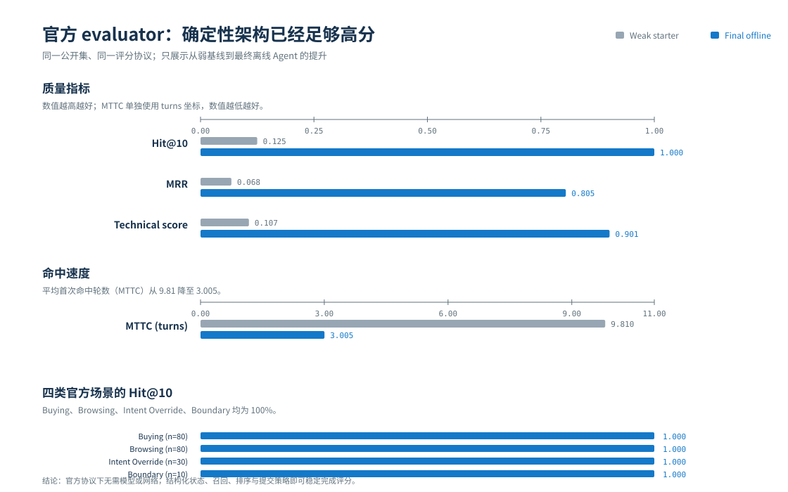
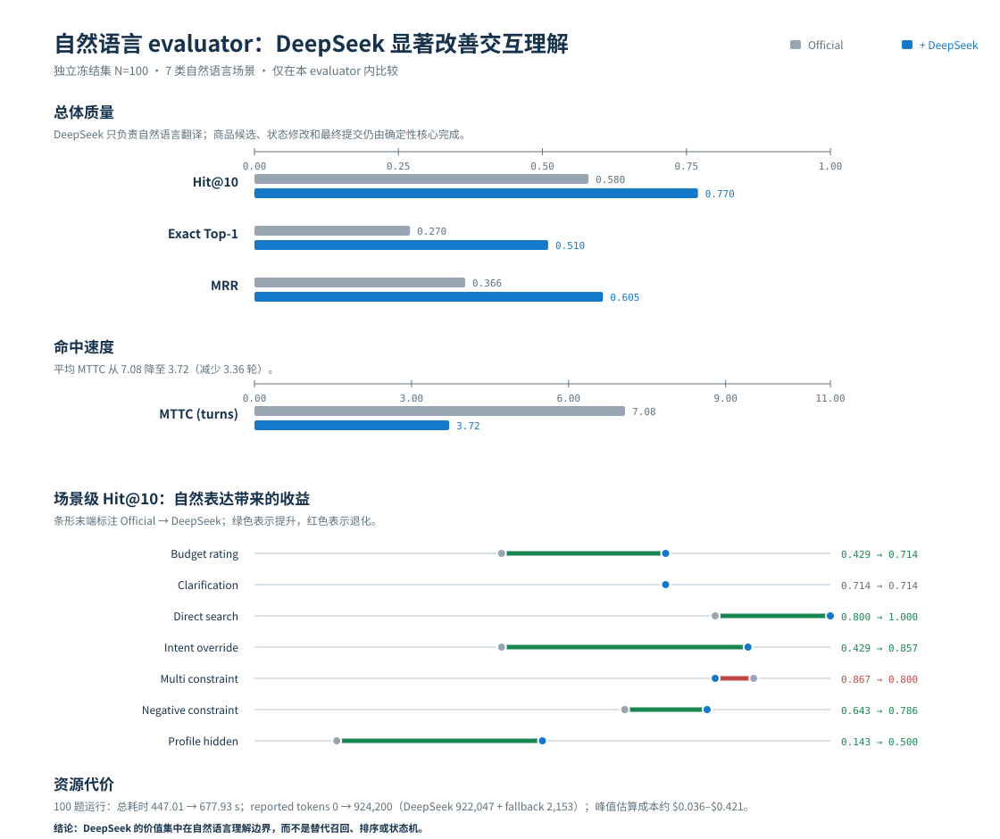

# TechJam 多轮对话电商搜索

[English](README.en.md) | **简体中文**

一个面向冻结商品目录的多轮购物搜索 Agent。它会持续维护用户意图，理解新增条件、否定、局部修改和“无偏好”回答，通过必要的澄清逐步缩小候选范围，并在最多 10 轮内返回 Top-10 `parent_asin`。

项目采用“**确定性搜索核心 + 可选自然语言翻译层**”的混合架构：召回、过滤、排序、状态更新和最终推荐始终由可审计的本地系统控制；DeepSeek 只在显式启用时帮助理解复杂自然语言，失败后会原子化回退到离线规则。

> 核心结论：官方协议可以由零 token、无需网络的确定性 Agent 稳定解决；真实自然语言场景则受益于一个受约束、可校验的 LLM 理解层。

## 核心结果

### 官方公开集：确定性离线 Agent

在官方 200 题公开集上，离线 Agent 的 Technical Score 从弱 starter 的 `0.106710` 提升到 `0.901407`，四类官方场景的 Hit@10 均为 1.0。

| 指标 | 弱 starter | 最终离线 Agent |
| --- | ---: | ---: |
| Hit@10 | 0.125 | **1.000** |
| MRR | 0.068034 | **0.805024** |
| MTTC | 9.81 | **3.005** |
| Technical Score | 0.106710 | **0.901407** |



### 独立自然语言评测：DeepSeek 增强

官方协议无法充分覆盖同义表达、指代、负向条件和隐藏偏好。我们因此在独立仓库中构建了自然语言 evaluator v2，并冻结 100 个多轮样本。在这套评测中，受控模型层将 Hit@10 从 `0.580` 提升到 `0.770`，同时显著缩短首次命中轮数。

| 指标 | 确定性 Agent | + DeepSeek | 变化 |
| --- | ---: | ---: | ---: |
| Hit@10 | 0.580 | **0.770** | +19 个百分点 |
| Exact Top-1 | 0.270 | **0.510** | +24 个百分点 |
| MRR | 0.365913 | **0.605179** | +0.239266 |
| MTTC | 7.08 | **3.72** | -3.36 轮 |



两套 evaluator 的数据和交互协议不同，不能混成一个排行榜：官方 evaluator 衡量协议内的稳定完成度，自然语言 evaluator 衡量表达鲁棒性。完整实验边界、延迟、token 与成本见[对比报告](docs/reports/evaluator-comparison-2026-08-31.md)。

## 为什么不能只做关键词搜索

购物意图会在多轮对话中持续变化。例如，用户可能先确定品类，再补充预算，随后排除黑色，把品牌改成 Skechers，最后表示材质没有偏好。简单拼接历史消息会让旧条件和新条件互相污染、把局部修改误解为全部重置，并可能过早移除目标商品。

本项目显式维护当前类别、硬约束、软偏好、否定条件、已问属性、Boundary 状态、意图 epoch、候选池、推荐历史和证据来源。所有状态变化统一经过 `StateReducer`，使新增、撤销与覆盖操作都可以追踪和测试。

## 系统架构

`starter.agent.Agent` 是唯一正式入口。官方 evaluator、自然语言 benchmark、CLI 和测试都调用同一个实现，不存在单独的比赛特供 Agent。

```mermaid
flowchart LR
    U[用户消息与匿名 profile] --> A[Agent facade]

    subgraph UNDERSTANDING[1. 对话理解]
        P[协议 adapter / 规则解析]
        L[可选 DeepSeek 翻译层]
        V[语义与 catalog 校验]
    end

    subgraph STATE[2. 状态管理]
        R[StateReducer]
        S[会话状态与 intent epoch]
    end

    subgraph SEARCH[3. 搜索与决策]
        RT[Buying / Browsing 路由]
        C[FTS/BM25 + 类目召回]
        F[结构化过滤与零结果回退]
        K[确定性排序]
        Q[澄清 / 推荐提交策略]
    end

    subgraph OUTPUT[4. 输出边界]
        G[Schema 与合法 ID 守卫]
        O[message · ask_attribute · recommendations]
    end

    A --> P
    A -. 显式启用 .-> L
    L --> V
    V -->|通过| R
    V -->|失败：整轮离线回退| P
    P --> R --> S --> RT --> C --> F --> K --> Q --> G --> O
    Q -->|信息不足| O
    O -->|下一轮| U
```



### 单轮处理流程

1. **解释输入：**根据 `official` 或 `natural_language` profile 解析本轮消息；可选模型只生成受限的购物事实，不生成商品推荐。
2. **更新状态：**`StateReducer` 根据证据来源合并新增条件、否定、撤销或局部 override；意图切换时开启新的 epoch。
3. **生成候选：**Buying/Browsing 路由选择召回策略，SQLite FTS5/BM25、类目索引和结构化候选池共同保留高召回率。
4. **过滤与排序：**逐项应用硬约束；零结果时按受控顺序放宽，并保留 lexical tail，随后融合词法、结构化和候选统计特征排序。
5. **澄清或提交：**候选信息不足时选择区分度高且尚未询问的属性；否则提交排序结果。
6. **守卫输出：**去除重复或非法 ID，保证响应 schema 合法。模型不可用或输出无效时，确定性结果仍可正常返回。

更细的模块关系、稳定接口和修改影响面见[系统架构文档](docs/architecture.md)。

## 两种协议 Profile

| Profile | 适用场景 | 输入与澄清 | 共享确定性核心 |
| --- | --- | --- | --- |
| `official` | 官方冻结协议与离线提交 | 官方 adapter、稳定顺序澄清、结构化字段 | 状态、候选池、召回、排序、提交和响应守卫 |
| `natural_language` | 真实表达和独立 benchmark | `IntentInterpreter`、catalog grounding、信息增益澄清、可选模型层 | 状态、候选池、召回、排序、提交和响应守卫 |

Profile 只选择协议适配和策略配置，不会自动启用网络模型。DeepSeek、本地 OpenAI-compatible 后端和 Qwen reranker 都必须单独显式配置。

## 受控自然语言翻译层

DeepSeek 不直接访问目标商品，也不决定推荐列表。它只把用户表达转成一行一个条件的 `canonical_text`，例如：

```json
{
  "canonical_text": "A key requirement is: use_case: rainy commutes.\nA key requirement is: budget: under $80.\nI do not want color: black.\nActually, change the brand to Skechers."
}
```

这份中间结果必须通过原子校验：字段必须在允许列表中，品牌、颜色、材质等值必须能在本地 catalog 中 grounding，不能包含商品 ID，也不能凭空删除用户未撤销的偏好。任一检查失败都会放弃整轮模型结果，直接使用规则解析，避免部分正确、部分错误的状态污染。

## 自然语言 Evaluator v2

独立 evaluator 不是让 LLM 随机扮演用户，而是一个可冻结、可验证且不向 Agent 泄露目标的测试器：

```text
冻结 catalog
  → 确定性选取目标，并生成唯一事实签名
  → 拆分初始 query、匿名 profile 与隐藏 clarification slots
  → Agent 追问后只披露目标支持的下一条事实
  → 保存逐轮 trace
  → 精确计算 Top-10 parent_asin、首次排名与首次命中轮数
```

100 个冻结样本覆盖 Budget Rating、Clarification、Direct Search、Intent Override、Multi Constraint、Negative Constraint 和 Profile Hidden 七类场景。目标 ID 和事实签名只存在于 evaluator 父进程与评分器中，不进入 Agent 调用栈。实现与数据集位于 [techjam-natural-language-benchmark](https://github.com/deequoique/techjam-natural-language-benchmark)。

## 快速开始

需要 Python 3.10 或更高版本。默认离线路径仅依赖 Python 标准库，不需要 API key 或网络。

### 1. 准备商品目录

从仓库对应的 GitHub Release 下载 `catalog.jsonl.gz` 和 `SHA256SUMS`，在仓库根目录校验并解压：

```bash
shasum -a 256 catalog.jsonl.gz
gzip -dc catalog.jsonl.gz > data/catalog.jsonl
```

`data/catalog.jsonl` 是不纳入 Git 的本地大文件。字段与数据边界见 [`data/README.md`](data/README.md)。

### 2. 运行测试

```bash
python3 -m unittest discover -s tests -v
```

测试使用临时小型 catalog，不需要完整数据，也不访问网络。

### 3. 复现官方离线评测

```bash
python3 -m evaluator.local_evaluator \
  --protocol-profile official \
  --catalog data/catalog.jsonl \
  --dataset data/public_set.jsonl \
  --output /tmp/techjam-official-offline.json
```

### 4. 启动交互式 CLI

```bash
python3 -m starter.cli --protocol-profile official
```

输入 `:help` 查看命令，`:reset` 重置会话，`:exit` 或 `quit` 退出。

### 5. 可选：启用 DeepSeek 自然语言路径

在被 Git 忽略的 `.env` 中设置 `SHOPPING_AGENT_DEEPSEEK_API_KEY`，再显式启用模型层：

```bash
set -a; source .env; set +a
export SHOPPING_AGENT_INTENT_MODEL_ENABLED=true
export SHOPPING_AGENT_INTENT_MODEL_MODE=model_first
export SHOPPING_AGENT_MODEL_TIMEOUT_SECONDS=30

python3 -m starter.cli \
  --protocol-profile natural_language \
  --show-diagnostics
```

不要把 API key 写入命令、源码或提交产物。更多开关和回退顺序见[可选模型后端](docs/development/model-backends.md)。

## Agent 接口

评估器为每个会话先调用 `reset`，再逐轮调用 `respond`：

```python
from starter.agent import Agent

agent = Agent(protocol_profile="official")
agent.reset(session_id="demo", user_profile={})
response = agent.respond(
    session_id="demo",
    user_message="I need walking shoes under $80",
    turn=1,
    top_k=10,
)
```

请求、响应字段和枚举以 [`docs/agent_api_contract.json`](docs/agent_api_contract.json) 为准。

## 仓库结构

| 路径 | 职责 | 是否进入正式运行链路 |
| --- | --- | --- |
| `starter/agent.py` | 唯一 Agent facade、会话生命周期和单轮编排 | 是 |
| `starter/shopping_agent/` | 意图、状态、召回、过滤、排序、策略、模型与响应组件 | 是 |
| `evaluator/` | 官方公开集模拟与评分 CLI | 否，外部调用 Agent |
| `tests/` | 合同与回归测试；`tests/benchmarks/` 保存离线实验工具 | 否 |
| `data/` | 公开开发集及本地冻结 catalog | 数据输入 |
| `docs/` | 架构、接口、评测报告、开发指南和比赛规则 | 否 |
| `notebooks/` | 可选 Qwen reranker 实验 | 否 |

## 文档导航

- [系统架构](docs/architecture.md)：模块边界、每轮数据流、失败边界和修改影响面。
- [本地开发与评测](docs/development/local-evaluation.md)：catalog、测试、评测和常见问题。
- [Evaluator 对比报告](docs/reports/evaluator-comparison-2026-08-31.md)：四组实验的质量、延迟、token 和成本。
- [可选模型后端](docs/development/model-backends.md)：DeepSeek、本地端点、Qwen 与回退配置。
- [文档总览](docs/README.md)：完整文档索引。

## 技术栈

- Python 3.10+、标准库 `unittest`
- SQLite FTS5 / BM25，本地结构化索引
- 可选 DeepSeek OpenAI-compatible API
- 可选 Qwen cross-encoder（`sentence-transformers` / PyTorch）
- Jupyter / Colab 实验 notebook

## 局限与下一步

1. 自然语言 evaluator 仍是冻结 benchmark，不能代表所有真实用户分布。
2. 全轮 model-first 会增加延迟和 token 成本，也可能损害模板化官方输入；后续应优先探索规则优先或低置信度触发。
3. 当前模型层主要负责意图翻译，尚未覆盖长期偏好学习、个性化解释和多商品比较。
4. 后续评测需要完整记录失败请求的 usage 与 cache 命中，进一步收紧多条件校验。

## 项目链接

- [GitHub](https://github.com/ByteSize2026/techjam-conversational-search)
- [Demo Video](https://www.youtube.com/watch?v=YbMLngGerx8)
- [自然语言 Evaluator v2](https://github.com/deequoique/techjam-natural-language-benchmark)

公开集与商品目录派生自 Amazon Reviews 2023。使用或再分发前请阅读 [`DATA_ATTRIBUTION.md`](DATA_ATTRIBUTION.md)。
