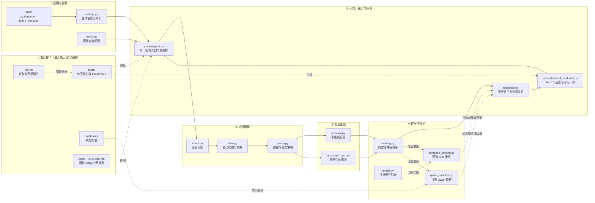

# 系统架构

## 架构目标

项目需要在同一正式 Agent 中同时满足三类约束：保持多轮会话状态、从冻结 catalog 返回
有效商品 ID，并在外部模型不可用时继续确定性运行。当前架构因此采用一个稳定 facade，
把状态、召回、排序和响应校验拆成可组合组件。

`starter.agent.Agent` 是唯一正式入口。评估器、测试和 benchmark 不应切换到另一套比赛
特供 Agent。

## 项目板块地图



图中的实线表示正式单轮运行链路，虚线表示可选增强或开发支撑关系。`.trellis/` 只管理任务、
规范和开发知识，不属于 Agent 的运行时依赖。

## 每轮数据流

```text
catalog.jsonl + public_set.jsonl
            │
            ▼
evaluator.local_evaluator
  reset(session_id, user_profile)
  respond(session_id, user_message, turn, top_k)
            │
            ▼
starter.agent.Agent
  1. 解析消息并更新当前 intent epoch / 约束
  2. 根据 Buying / Browsing 倾向选择召回路线
  3. 召回并按结构化约束构造候选池
  4. 计算候选统计、gate 与确定性特征排序
  5. 可选：对有界候选集进行 LLM 或 Qwen 语义重排
  6. 决定是否追问、提交多少推荐，并校验响应合同
            │
            ▼
evaluator 过滤前 10 个有效唯一 parent_asin
            │
            ▼
Hit@10 / MRR / MTTC / scenario metrics
```

模型重排是可选阶段。没有模型配置、模型失败、输出 JSON 无效或候选 ID 不合规时，系统保留
原确定性候选顺序并继续返回合同有效的响应。

追问采用“先宽后窄”的有界策略：当前意图第一次信息不足时可以询问一次 `other`，让官方
模拟器或真实用户一次补充任意重要条件；后续不再机械重复 `other`，而是根据当前候选中各属性
的熵和元数据覆盖率，确定性地选择最能区分候选的具体字段。已确认、已拒绝或已问过的字段不会
重复询问。只有官方协议明确发出 boundary 重开事件时，才允许事件级额外询问一次 `other`；
所有可用字段耗尽后停止追问并提交当前推荐。

## 模块职责

| 位置 | 职责 |
| --- | --- |
| `starter/agent.py` | 依赖组装、会话生命周期、整轮编排、诊断和最终响应守卫 |
| `starter/shopping_agent/catalog.py` | catalog 读取、商品记录、SQLite FTS、类目索引、字段值索引与有效 ID 集合 |
| `starter/shopping_agent/config.py` | 从显式环境变量构造离线安全配置，不执行 I/O |
| `starter/shopping_agent/state.py` | 会话状态、意图证据、约束更新、Intent Override 与 epoch 隔离 |
| `starter/shopping_agent/policy.py` | 意图路由、候选 gate、澄清策略和推荐提交策略 |
| `starter/shopping_agent/retrieval.py` | 多路线召回、类目预算、候选合并、多样化与召回诊断 |
| `starter/shopping_agent/structured_pool.py` | 用结构化硬约束构造或逐步放宽候选池 |
| `starter/shopping_agent/ranking.py` | 候选统计、词法证据、特征融合、确定性排序与排名证据 |
| `starter/shopping_agent/model.py` | DeepSeek / 本地 OpenAI-compatible 后端和分层失败处理 |
| `starter/shopping_agent/semantic_ranking.py` | 有界 LLM listwise 重排、JSON 校验和候选顺序修复 |
| `starter/shopping_agent/qwen_reranker.py` | 显式本地 checkpoint 的 Qwen cross-encoder 重排 |
| `starter/shopping_agent/response.py` | 语义适配、usage/failure 提取、fallback 与响应合同校验 |
| `evaluator/local_evaluator.py` | 顾客模拟、响应标准化、精确 ID 命中与指标计算 |

## 稳定边界

### Agent 接口

公开入口必须导出 `Agent`，并保持：

```python
reset(self, session_id: str, user_profile: dict) -> None
respond(self, session_id: str, user_message: str, turn: int, top_k: int) -> dict
```

`respond` 至少返回字符串 `message`、允许值或 `None` 的 `ask_attribute`，以及按优先级排列
的 `recommendations`。完整字段限制见 [Agent API Contract](agent_api_contract.json)。

### 会话隔离

状态以 `session_id` 存储。`reset` 替换该会话的旧状态；Intent Override 可以开启新的 intent
epoch 并使被覆盖证据失效，但不能影响其他会话。Boundary 场景中的“没有偏好”也属于会话
状态，不能被当作任意匹配。

### 推荐与评分

Agent 只能推荐冻结 catalog 中的 `parent_asin`。API schema 允许返回更多候选，但 evaluator
只保留最先出现的 10 个有效、唯一 ID，并使用精确字符串相等判断命中。修改排序或响应守卫
时必须以这一过滤顺序为准。

### 兼容委托

`Agent` 保留 `_retrieve`、`_feature_rank`、`_rank_evidence`、`_valid_ids` 等薄委托。测试和
benchmark 会直接调用或替换这些入口；内部重构时，整轮编排仍应通过实例方法调用它们。

## 依赖与失败边界

- 默认路径只依赖 Python 标准库，并使用确定性召回与排序。
- DeepSeek 只有在提供 API key 后才启用；本地兼容后端只有在 URL 和模型名同时存在时启用。
- Qwen 只有在提供绝对本地 checkpoint 路径时才启用，Agent 不会隐式下载模型。
- 模型阶段只接收有界候选集；失败不会扩大合法候选集合，也不会中断公开响应合同。
- `usage` 只记录成功后端返回的合法非负 token 数，失败 tier 不计入。

配置方式见[可选模型后端](development/model-backends.md)。

## 修改影响面

| 修改目标 | 主要位置 | 至少检查 |
| --- | --- | --- |
| 会话或意图解析 | `state.py`、`agent.py` | session 隔离、Intent Override、Boundary 回归 |
| 召回路线或预算 | `policy.py`、`retrieval.py`、`structured_pool.py` | 四种场景的候选覆盖和离线确定性 |
| 排序信号 | `ranking.py`、可选 reranker | 前 10 个有效唯一 ID、fallback 顺序、benchmark |
| 响应字段 | `response.py`、`agent.py` | API schema、`ask_attribute` 枚举、usage |
| 评分逻辑 | `evaluator/`、`evaluation_config.json` | miss=11、精确匹配、指标权重和 evaluator 测试 |
| 数据格式 | `catalog.py`、`data/` 文档 | UTF-8 JSONL、`parent_asin`、隐私与提交边界 |

本项目的标准验证入口见[本地开发与评测](development/local-evaluation.md)。离线实验工具固定
放在 `tests/benchmarks/`，见[离线 benchmark](development/benchmarks.md)。
