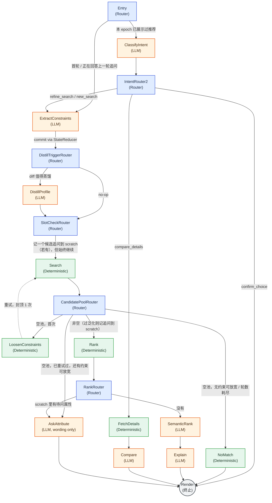

# Shopping Agent 架构图（Router / Value-Node 图）

本图对应当前代码库里实际运行的图结构 `starter/shopping_agent/graph.py`（`ROUTERS`/`NODES`），
配合文字说明见 `AGENT_ARCHITECTURE.md`。三种颜色对应三种节点角色：

- 🔵 **蓝色 = Router**：纯代码，只决定"下一个节点是谁"，从不调用模型。
- 🟢 **绿色 = 确定性 Value Node**：算法/查表产出一个事实（检索、排序、放宽约束、查详情）。
- 🟠 **橙色 = LLM Value Node**：一次结构化输入输出的模型调用产出一个事实；离线或解析失败时退化为
  各自的确定性 fallback（见 `AGENT_ARCHITECTURE.md` §4）。
- ⚪ **灰色圆角 = 终止节点** `Render`。

虚线是全图唯一允许重复经过的一条边（`LoosenConstraints → Search`），由 `search_retry_count`
计数器守卫、封顶 1 次、每个官方轮次开始时清零——这是唯一的环，其余部分是一张 DAG。

## 场景对照

`artifacts/scenario_showcase/` 下的六段真实多轮对话 trace，每一段都能在这张图上按边追踪：

| 场景文件 | 在图上走的路径（简化） |
|---|---|
| `01_vague_clarify_converge` | `SlotCheckRouter`/`RankRouter` 反复把待问属性递给 `AskAttribute`，直到证据/预算耗尽转向 `SemanticRank` |
| `02_over_general_fill_missing` | `CandidatePoolRouter` 记过泛化追问 → `Rank` → `RankRouter` → `AskAttribute` |
| `03_intent_override` | `IntentRouter2` 的 `new_search` 分支（带 `global_override`）回到 `ExtractConstraints` |
| `04_multiturn_rank_reorder` | 多轮 `Search → Rank → RankRouter → SemanticRank` 循环，观察排序随约束累积变化 |
| `05_empty_search_retry_relax` | 唯一的环：`CandidatePoolRouter → LoosenConstraints → Search`，重试后走 `AskAttribute(relax_conflict)` |
| `06_true_dead_end_no_match` | `CandidatePoolRouter` 重试后仍为空且无约束可放 → `NoMatch` |

## 如何导出为图片

这是标准 Mermaid 语法，可以用以下任意一种方式直接导出 PNG/SVG：

- VS Code 装 "Markdown Preview Mermaid Support" 插件后直接预览本文件并导出。
- 粘贴到 [mermaid.live](https://mermaid.live) 在线编辑器导出。
- 命令行：`npx @mermaid-js/mermaid-cli -i docs/architecture_diagram.md -o architecture.png`（需要先把 mermaid 代码块单独存成 `.mmd` 文件）。
- GitHub 会在仓库页面直接原生渲染这个代码块，无需任何额外步骤。
