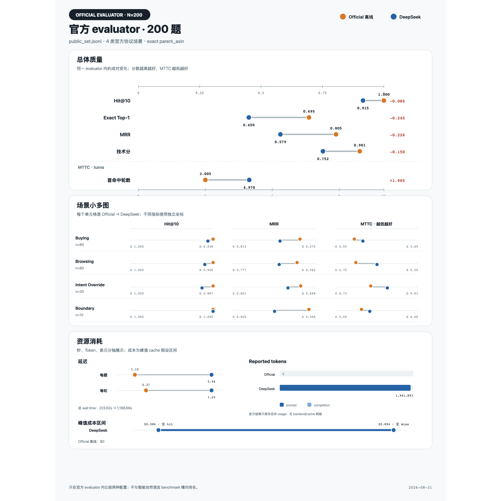
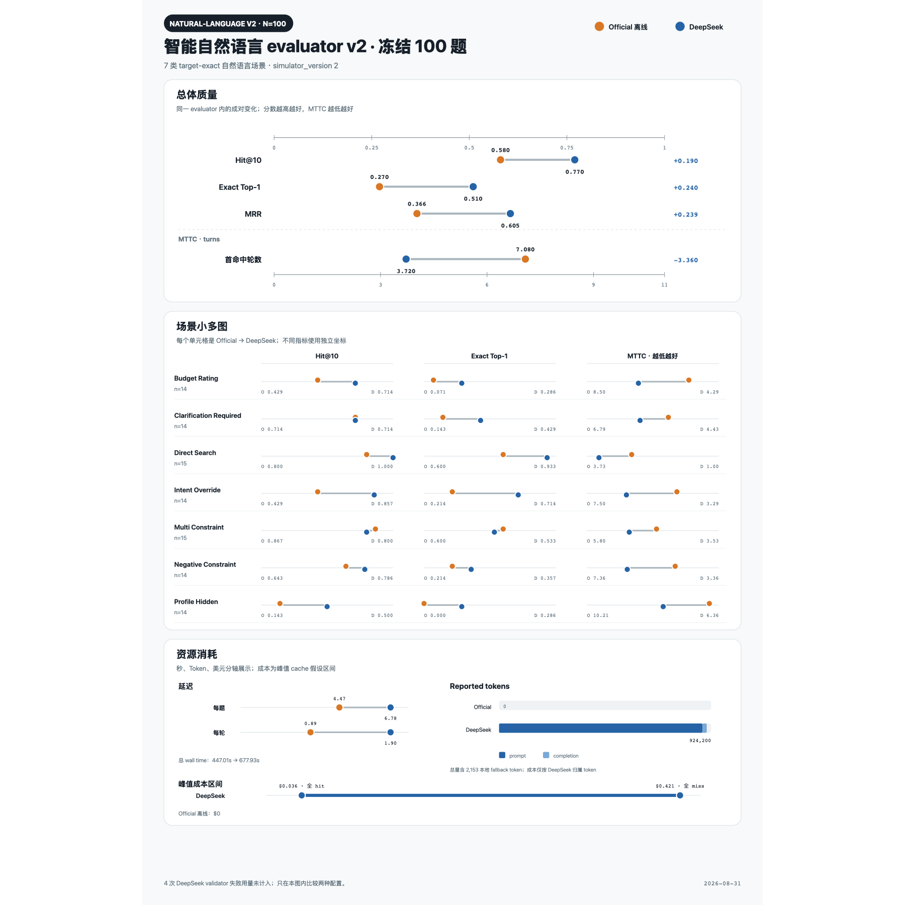

# Evaluator 对比实验记录（2026-08-31）

本文统一记录当前工作区购物 Agent 在两套 evaluator、两种运行配置下的四次完整实验，供模型选型、提交披露和后续回归使用。原始结果没有保存 Agent commit SHA，因此本文不主张仅凭四个 JSON 就能独立证明它们来自完全相同的代码版本。




> **可比性边界：**官方公开集和智能自然语言冻结集的样本、场景与对话模拟协议不同。质量指标只能在同一 evaluator 家族内直接比较，不能把 200 题和 100 题结果混成一个排行榜。

## 测试矩阵

| 编号 | Evaluator 与数据集 | 样本 | Agent profile | 模型配置 |
| --- | --- | ---: | --- | --- |
| M-OFF | 主仓库官方 `local_evaluator` + `public_set.jsonl` | 200 | `official` | 纯离线；无模型 backend |
| M-DS | 主仓库官方 `local_evaluator` + `public_set.jsonl` | 200 | `natural_language` | DeepSeek V4 Flash；`model_first` |
| S-OFF | 独立智能 `IntelligentSimulator v2` + 冻结集 | 100 | `official` | 纯离线；无模型 backend |
| S-DS | 独立智能 `IntelligentSimulator v2` + 冻结集 | 100 | `natural_language` | DeepSeek V4 Flash；`model_first` |

共同设置：50,000 商品冻结 catalog、Top-10 精确 `parent_asin` 评分、最多 10 轮、单 worker 串行执行。智能 benchmark 使用独立仓库 `techjam-natural-language-benchmark` 的 `frozen-100-seed-20260830.jsonl`，模拟器版本为 2。

## 核心结果

精确数值、变化方向和资源消耗见上方两张独立图。官方 evaluator 的关键结果是 Hit@10 `1.000 → 0.915`、MRR `0.805024 → 0.578792`、Technical Score `0.901407 → 0.751738`；智能自然语言 evaluator v2 的关键结果是 Hit@10 `0.580 → 0.770`、Exact Top-1 `0.270 → 0.510`、MRR `0.365913 → 0.605179`。两张图分别标明样本规模和 evaluator 边界，不应合并排名。

官方 evaluator 的 Exact Top-1 是从 session 的 `best_rank == 1` 派生；其结果 JSON 不保存 error counter，因此协议错误只能记为“未记录”。智能 benchmark 明确记录 `error_count`，两次均为 0。

同一 evaluator 内的变化：

- **官方 200：**启用 DeepSeek 后，Hit@10 下降 8.5 个百分点，MRR 下降 0.226232，MTTC 增加 1.965 轮，Technical Score 下降 0.149669。
- **智能 100：**启用 DeepSeek 后，Hit@10 提升 19 个百分点，Top-1 提升 24 个百分点，MRR 提升 0.239266，MTTC 减少 3.36 轮。

这说明模型价值取决于输入协议：在冻结、模板化的官方协议上，确定性解析更准确；在同义表达、自然语言追问、负向约束和意图覆盖等难例上，模型显著改善意图理解和排序。

## 延迟、Token 与成本

资源数据已分别绘制在两张图的“资源消耗”区域：官方 evaluator 200 题总耗时 `223.62 → 1,188.66 s`，智能自然语言 evaluator v2 100 题总耗时 `447.01 → 677.93 s`。官方离线两组均为 0 token、$0；联网组显示 prompt/completion 堆叠、每题/每轮延迟点图和 cache 假设下的成本区间。

官方 evaluator 的 DeepSeek reported usage 为 `1,941,893` tokens；智能 evaluator 为合并 usage `924,200` tokens，其中 DeepSeek 归属 `922,047`、本地 fallback `2,153`。

² S-DS 的总量包含 3 次本地模型 fallback：2,153 tokens；DeepSeek 成功用量为 904,254 prompt + 17,793 completion = 922,047 tokens。

³ M-DS 的官方 evaluator 只保存响应 `usage` 总量，不保留 backend 和 cache 明细；该行按评测配置把成功报告用量归到 DeepSeek，证据强度低于 S-DS 的逐轮 diagnostics。

### 成本口径

运行当日采用 DeepSeek 官方 V4 Flash 价格：

| 时段 | Cache-hit input / 1M | Cache-miss input / 1M | Output / 1M |
| --- | ---: | ---: | ---: |
| 非高峰 | $0.007 | $0.22 | $0.66 |
| 高峰 | $0.014 | $0.44 | $1.32 |

两次联网完整评测发生在周一 08:00–10:00 UTC 高峰窗口。报告上界按：

```text
cost = prompt_tokens / 1,000,000 × cache-miss input price
     + completion_tokens / 1,000,000 × output price
```

这些数值是估算，不是账单：官方 evaluator 没有保存 `prompt_cache_hit_tokens`；智能结果虽保留成功 backend，却仍不累计校验失败请求的 usage。S-DS 另有 4 次 DeepSeek validator 失败、1 次本地 validator 失败；失败请求若已产生 token，真实账单会略高。S-OFF 经逐轮 diagnostics 审计为零 backend、零 token；M-OFF 的离线身份来自运行时显式清空模型环境变量，结果 JSON 只能证明 reported usage 为零，不能独立审计 backend。

## 场景结果

两张图中的“场景小多图”替代原始场景表格。官方 evaluator 覆盖 Buying、Browsing、Intent Override、Boundary；智能自然语言 evaluator v2 覆盖 Budget Rating、Clarification Required、Direct Search、Intent Override、Multi Constraint、Negative Constraint、Profile Hidden。智能组中 DeepSeek 对 Intent Override、Profile Hidden 和 Direct Search 的收益最明显；Multi Constraint 的整体质量略退，但 MTTC 仍改善。

## 结论

1. **提交默认路径应保留 Official 离线策略。**它在官方公开协议上达到 Hit@10 1.0、Technical Score 0.901407，且零模型成本。
2. **DeepSeek 适合作为选择性自然语言增强层，而不是全轮 model-first。**智能集收益显著，但延迟和 token 成本明显增加；官方协议上还会损害质量。
3. **优先考虑规则优先或低置信度触发。**目标是保留 official 模板的确定性优势，只把真正的自然语言难例交给模型。
4. **下一轮测量应补齐 cache 和失败 usage。**adapter/reporting 应保留 `prompt_cache_hit_tokens`、`prompt_cache_miss_tokens`，并记录失败请求的 provider usage（如果服务端返回）。

## 复现命令

以下命令从两个仓库各自根目录运行。API key 只通过被 Git 忽略的 `.env` 注入，不得写入报告或结果文件。

### M-OFF：官方 200，Official 离线

```bash
unset SHOPPING_AGENT_DEEPSEEK_API_KEY SHOPPING_AGENT_LOCAL_BASE_URL \
  SHOPPING_AGENT_LOCAL_MODEL SHOPPING_AGENT_QWEN_RERANKER_MODEL_PATH

python3 -m evaluator.local_evaluator \
  --protocol-profile official \
  --catalog data/catalog.jsonl \
  --dataset data/public_set.jsonl \
  --output /tmp/official-offline-200.json
```

### M-DS：官方 200，DeepSeek model-first

```bash
set -a; source .env; set +a
export SHOPPING_AGENT_INTENT_MODEL_ENABLED=true
export SHOPPING_AGENT_INTENT_MODEL_MODE=model_first
export SHOPPING_AGENT_MODEL_TIMEOUT_SECONDS=30

python3 -m evaluator.local_evaluator \
  --protocol-profile natural_language \
  --catalog data/catalog.jsonl \
  --dataset data/public_set.jsonl \
  --output /tmp/deepseek-official-200.json
```

### S-OFF：智能 100，Official 离线

```bash
cd /path/to/techjam-natural-language-benchmark
unset SHOPPING_AGENT_DEEPSEEK_API_KEY SHOPPING_AGENT_LOCAL_BASE_URL \
  SHOPPING_AGENT_LOCAL_MODEL SHOPPING_AGENT_QWEN_RERANKER_MODEL_PATH \
  SHOPPING_AGENT_INTENT_MODEL_ENABLED SHOPPING_AGENT_INTENT_MODEL_MODE

python3 -m nl_benchmark evaluate \
  --protocol-profile official \
  --agent-repo /path/to/techjam-conversational-search-main \
  --catalog /path/to/techjam-conversational-search-main/data/catalog.jsonl \
  --dataset outputs/frozen-100-seed-20260830.jsonl \
  --output /tmp/smart-official-100.json
```

### S-DS：智能 100，DeepSeek model-first

```bash
cd /path/to/techjam-natural-language-benchmark
set -a
source /path/to/techjam-conversational-search-main/.env
set +a
export SHOPPING_AGENT_INTENT_MODEL_ENABLED=true
export SHOPPING_AGENT_INTENT_MODEL_MODE=model_first
export SHOPPING_AGENT_MODEL_TIMEOUT_SECONDS=30

python3 -m nl_benchmark evaluate \
  --protocol-profile natural_language \
  --agent-repo /path/to/techjam-conversational-search-main \
  --catalog /path/to/techjam-conversational-search-main/data/catalog.jsonl \
  --dataset outputs/frozen-100-seed-20260830.jsonl \
  --output /tmp/smart-deepseek-100.json
```

若本机 Python CA bundle 配置异常，应修复 CA 路径后复现；不要在正式命令或 Agent 代码中关闭 TLS 验证。

## 本次结果产物

本次运行原始 JSON 写在临时目录，文档与图表保存于仓库：

- `/tmp/deepseek-public-200.json`（M-OFF）
- `/tmp/deepseek-natural-public-200.json`（M-DS）
- `/tmp/official-offline-smart-simulator-v2-current-100.json`（S-OFF）
- `/tmp/deepseek-smart-simulator-v2-current-100.json`（S-DS）
- `docs/diagrams/official_evaluator_comparison_200.svg/.png`（官方 evaluator 完整对比图）
- `docs/diagrams/smart_evaluator_comparison_100.svg/.png`（智能自然语言 evaluator v2 完整对比图）

`/tmp` 文件不是长期归档；本文件中的汇总表是四次运行的持久记录。逐题 trace 含 evaluator-only target 字段，不应复制进 Agent 提交包。

### 原始结果校验和

| 结果 | SHA-256 |
| --- | --- |
| M-OFF | `fa555b22b63f3d06320da01061577cb8d4b7e2b437d2ef5aef5aa067444fa720` |
| M-DS | `3df48cd6ab4655569688006187dacc19cb4453f660564ecf6d4a8ec46af13288` |
| S-OFF | `1989afc892385f1903b2911b0d4b6ee6e8a6a6af85dfab1f81db2653cf760331` |
| S-DS | `63bfb7cd8c9b62b068dfc2a6291745171ab21cb67f13f182a706aa210f08d325` |

官方 evaluator JSON 本身没有保存 protocol profile、模型配置、wall time 或 Agent commit SHA；这些运行身份来自本次命令记录和文件命名。智能 JSON 明确保存 `simulator_version: 2`、`scoring: exact parent_asin only`、Top-K、validation 与逐轮 diagnostics，但同样没有 Agent commit SHA。因而校验和可以证明本报告引用的是哪四个结果文件，却不能单独重建运行配置、wall time 或代码版本。
