# Workflow、架构与模块分解

本页从三个抽象层次解释当前实现：workflow 图关心一轮请求如何流动，架构图关心
运行时边界和依赖，模块分解图关心代码库的责任归属。图中的模型路径均是可选增强，
确定性召回、排序和响应守卫才是离线可用的主路径。

## 1. 单轮 workflow 图

这张图对应 `Agent.respond()` 的真实控制流。语义重排只处理有界的 Top-30 候选；模型失败、
JSON 无效或 ID 不合法时，系统保留确定性顺序并继续返回合同有效的响应。

[Mermaid 源图](diagrams/system_diagrams_01_flowchart_turn_workflow.mmd)

## 2. 系统架构图

正式运行边界只有 `starter.agent.Agent`。Evaluator 通过 `reset` / `respond` 调用它；
`CatalogRepository` 管理冻结商品数据和 SQLite FTS；外部或本地模型不得扩大合法候选
集，也不得绕过响应守卫。实线表示主路径，虚线表示可选增强或失败回退。

[Mermaid 源图](diagrams/system_diagrams_02_flowchart_system_architecture.mmd)

## 3. 模块分解图

这张图是纯职责树，不重复表达运行时调用关系。`starter/` 是正式运行时，`evaluator/`、
合同和数据文件定义评测边界，`tests/`、`notebooks/`、`docs/` 和 `.trellis/` 只提供开发
支撑。

[Mermaid 源图](diagrams/system_diagrams_03_flowchart_module_breakdown.mmd)

## 维护规则

- 修改 `Agent._respond_impl()` 的阶段顺序或决策分支时，同步更新 workflow 图。
- 新增运行时边界、模型后端或数据存储时，同步更新架构图。
- 新增、合并或拆分顶级包和核心模块时，同步更新模块分解图。
- 先校验 `.mmd` 并重新渲染 SVG，再提交文档变更。
